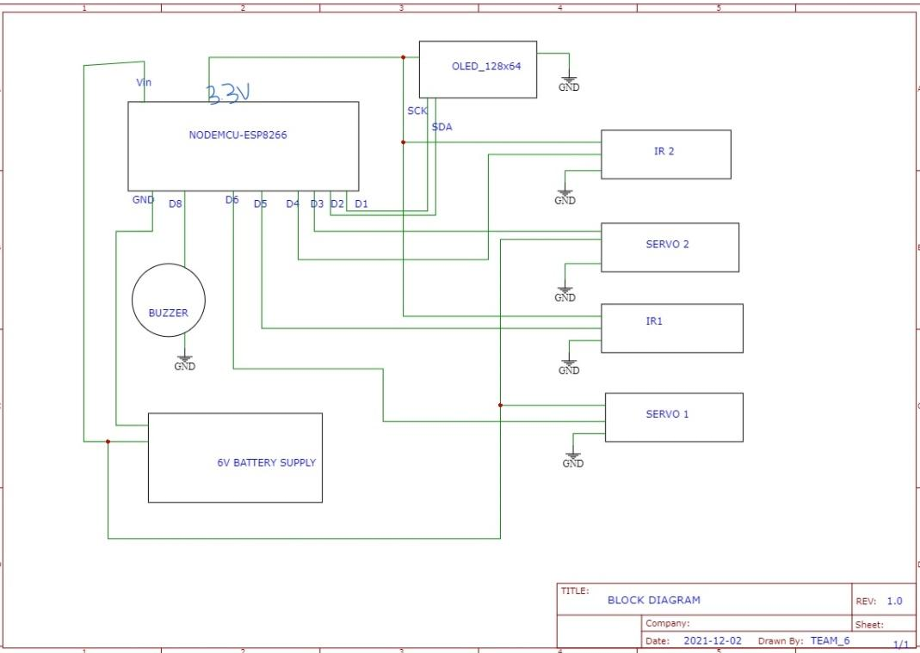
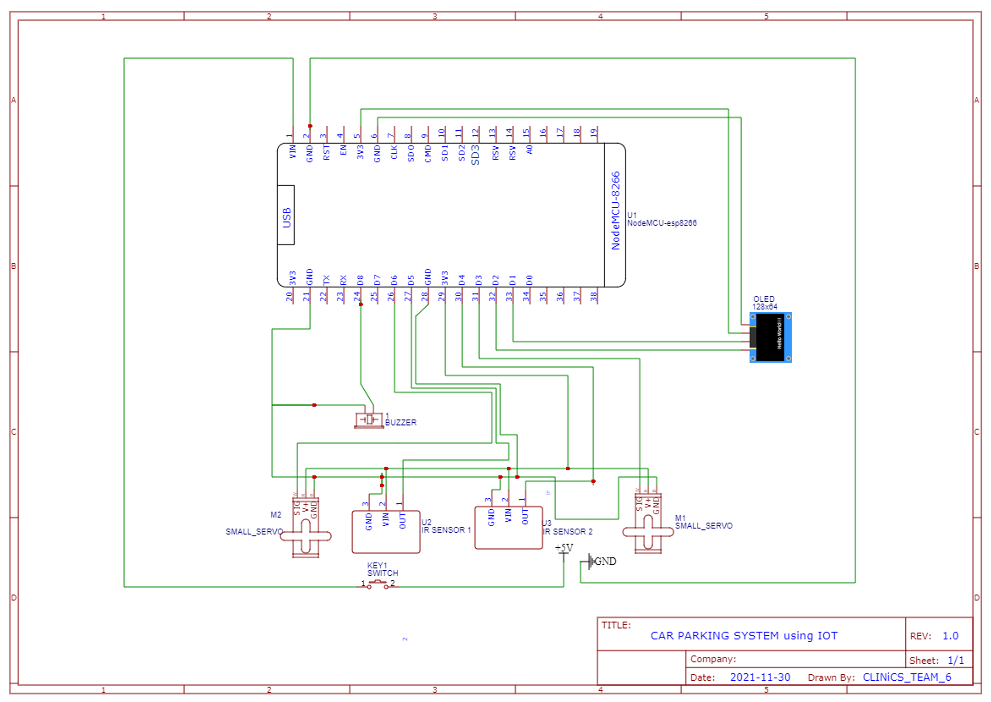
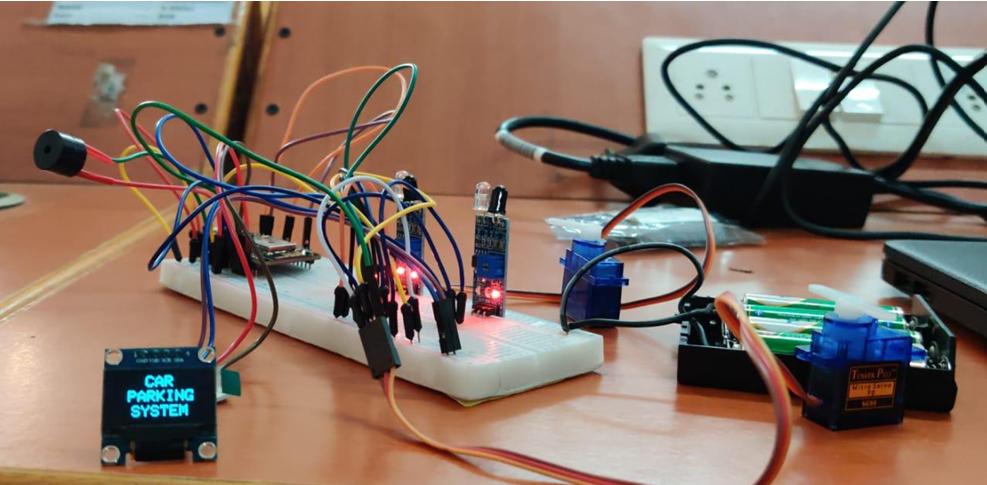

# IoT_SMART_PARKING_SYSTEM
IoT-based Smart Parking System using ESP8266, IR Sensors, Servo Motor and OLED Display.

# IoT-Based Smart Parking System

An IoT-enabled smart parking system developed using the ESP8266 NodeMCU to monitor parking slot availability in real time. The system detects vehicle movement using IR sensors, controls entry and exit barriers using servo motors, displays parking information on an OLED display, and hosts a web page to show the current parking status over Wi-Fi.

---

## Project Overview

Finding available parking spaces in crowded parking areas can be time-consuming and may lead to unnecessary congestion. This project provides a simple embedded solution that automates parking slot monitoring by detecting vehicle movement at the entrance and exit.

The ESP8266 acts as the central controller, processing sensor inputs, updating the parking count, controlling the barriers, displaying information locally on an OLED display, and serving the parking status through a built-in web server.

---

## Features

- Real-time parking slot monitoring
- Automatic entry and exit barrier control
- OLED display showing parking availability
- Wi-Fi based web interface for monitoring parking status
- Vehicle detection using IR sensors
- Audible startup indication using a buzzer
- Automatic calculation of available and occupied parking spaces

---

## Hardware Components

- ESP8266 NodeMCU
- 2 × IR Sensor Modules
- 2 × SG90 Servo Motors
- 128 × 64 OLED Display
- Buzzer
- 6V Battery Supply
- Breadboard
- Jumper Wires

---

## Software Used

- Arduino IDE
- Embedded C/C++
- ESP8266WiFi Library
- ESP8266WebServer Library
- Adafruit GFX Library
- Adafruit SSD1306 Library
- Servo Library

---

## System Architecture



---

## Circuit Schematic



---

## Working Principle

1. The ESP8266 initializes the OLED display, Wi-Fi access point, web server, sensors, and servo motors.

2. Two IR sensors monitor the vehicle movement at the entrance and exit.

3. When a vehicle is detected at the entrance:

   - The entry barrier opens.
   - Available parking spaces decrease by one.
   - OLED display and web page are updated.

4. When a vehicle exits:

   - The exit barrier opens.
   - Available parking spaces increase by one.
   - OLED display and web page are updated.

5. If all parking slots are occupied, the system prevents additional vehicles from entering and displays a "Slots Not Available" message.

---

## Pin Connections

|     Component       | NodeMCU Pin |
|---------------------|-------------|
| IR Sensor (Entry)   |     D5      |
| IR Sensor (Exit)    |     D4      |
| Servo Motor (Entry) |     D6      |
| Servo Motor (Exit)  |     D3      |
| OLED SCL            |     D1      |
| OLED SDA            |     D2      |
| Buzzer              |     D8      |

---

## Output

### Hardware Prototype



---

### OLED Display


---

### Web Interface


The embedded web server displays:

- Total Parking Slots
- Available Parking Slots
- Occupied Parking Slots

The webpage refreshes automatically to provide updated parking information.

---

## Repository Structure

```
iot-smart-parking-system/
│
├── README.md
├── docs/
│   └── Project_Report.pdf
├── src/
│   └── parking_system.ino
├── images/
│   ├── block_diagram.png
│   ├── circuit_schematic.png
│   ├── prototype_1.jpg
│   ├── prototype_2.jpg
│   ├── oled_display.jpg
│   └── web_interface.png
```

---

## Results

The implemented system successfully demonstrated:

- Automatic vehicle detection
- Real-time parking slot counting
- Automated gate operation
- OLED-based local monitoring
- Wi-Fi based remote monitoring using a web interface

---

## Future Improvements

- RFID-based vehicle authentication
- Mobile application integration
- Cloud database connectivity
- Automatic number plate recognition (ANPR)
- Multiple parking zone management
- IoT dashboard with historical parking analytics

---

## Author

**Srinath S**

B.E. Electronics and Communication Engineering

M.E. Embedded and Real-Time Systems
